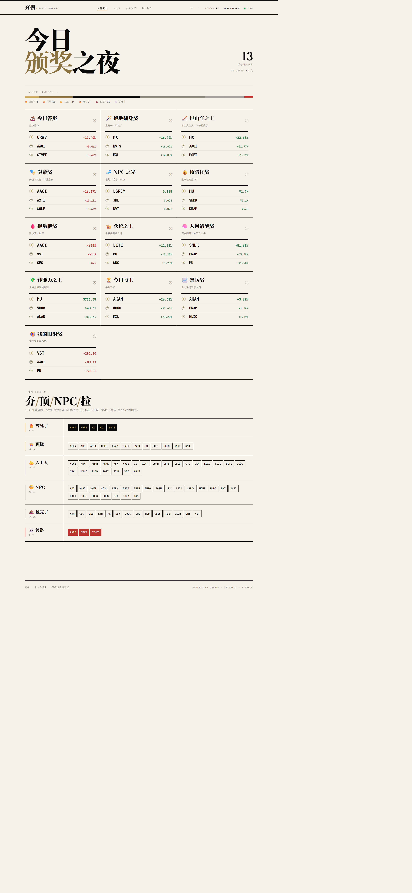
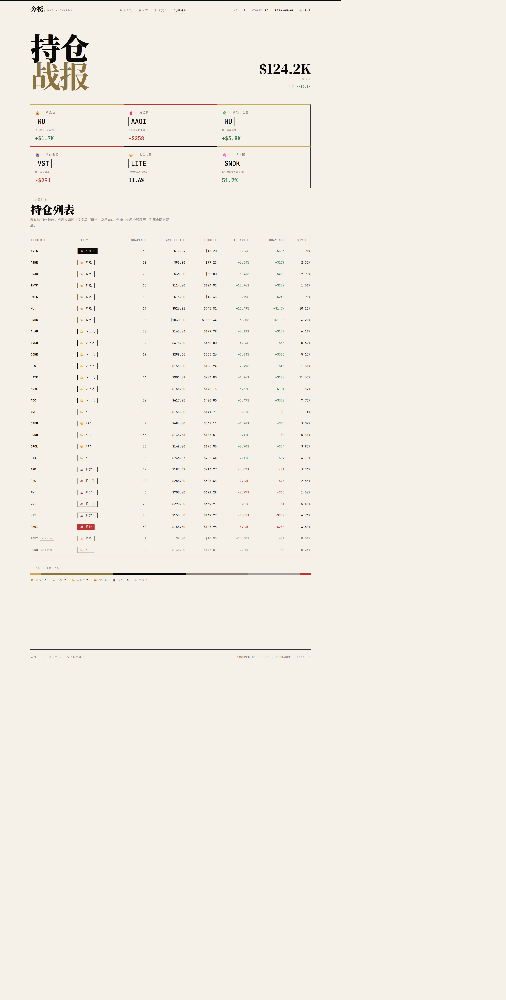
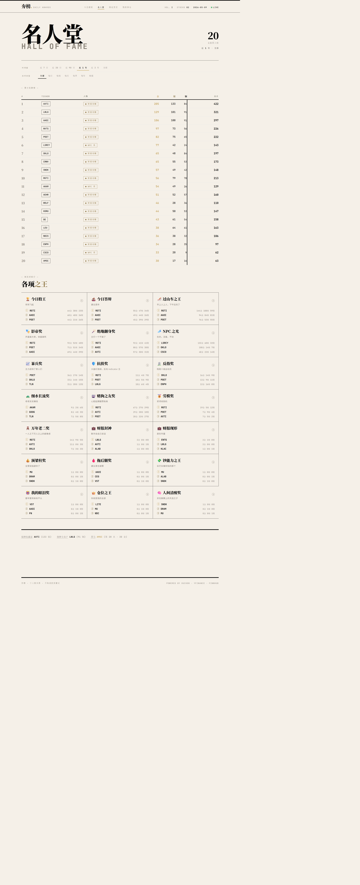
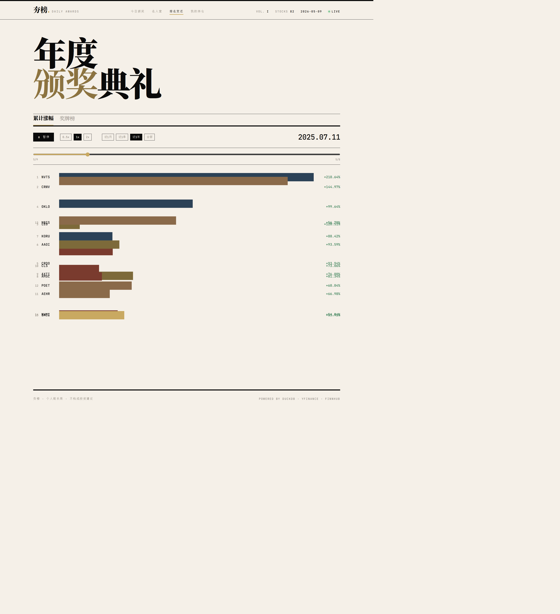

<div align="center">

# tickertier
### 夯股 · the daily tier-list for your tickers

[中文](./README.md) · **[English](./README.en.md)**

A self-hosted entertainment layer over your watchlist.
Every day, your stocks get awards and a tier.
🔥 夯死了 (S) → 👑 顶级 (A) → 💪 人上人 (B) → 😐 NPC (C) → 💩 拉完了 (D) → ☠️ 答辩 (F)

[](./LICENSE)
[](https://github.com/astral-sh/uv)
[]()
[]()
[]()



</div>

---

## Why this exists

I spent half a year building a watchlist of 81 AI-infrastructure stocks. NVDA, the obvious ones, plus a long tail of optical-transport, HBM, EDA, and networking-silicon names that nobody talks about. Every trading day I'd scan the whole list, open to close.

After a while I noticed something: **the daily price action across these 81 names is more entertaining than most TV drama.**

Some open at the highs and close at the lows — pure Oscar-bait. Some look dead all morning then rocket in the afternoon. Some put up a 20% intraday range and close flat, leaving you motion-sick. Some sit there all day, no volume, single-digit range — you reload thinking the data feed is broken.

One day, staring at a wall of red and green, I thought: instead of refreshing prices and getting anxious, **what if I just gave them awards?**

Today's Champion. Today's Disaster. The Comeback Kid. The Drama Queen. NPC of the Day. The Curse of the Galaxy. The names wrote themselves, and the more I wrote the more fun it got.

So that's tickertier (夯股). It's not a serious investing tool. It's an entertainment skin over real market data — turning your daily watch routine from *"refresh and worry"* into *"tune in for the awards show."* That's it. That's the pitch.

---

## Screenshots

<table>
<tr>
<td width="50%"><b>🎭 Today's Awards</b><br/>13 awards handed out, plus a six-tier ranking of the entire universe<br/></td>
<td width="50%"><b>📊 Portfolio Battle Report</b><br/>Real holdings → MVP / Worst / Top Position / Tears<br/></td>
</tr>
<tr>
<td width="50%"><b>🏛️ Hall of Fame</b><br/>All-time medal table + 8-class personality clustering<br/></td>
<td width="50%"><b>🏁 Race</b><br/>D3 bar chart race over arbitrary date ranges<br/></td>
</tr>
</table>

---

## The 22 awards

Three buckets. Daily awards run every trading day. Periodic awards run on rolling windows. Portfolio awards only appear once you drop in a `data/portfolio.json`.

### Daily (8)

| Award | Criterion | Vibe |
|---|---|---|
| 🏆 Champion | Highest daily return | "Absolute unit" |
| 💩 Disaster | Lowest daily return | "Delist this" |
| 🪄 Comeback Kid | Intraday low → close rebound % | "Dead and reborn in one session" |
| 🎢 Rollercoaster | Intraday range as % of open | "Up bad, down bad, both" |
| 🎭 Drama Queen | High → close drawdown (gap-up reversal) | "Won the open, lost the day" |
| 💤 NPC of the Day | Lowest range × volume | "Present. Alive. Motionless." |
| 📈 Volume Spike | Volume / 20-day average | "Someone showed up" |
| 🛡️ Defender | Up while QQQ is red | "Not me, the market" |

### Periodic (7)

| Award | Window | Criterion |
|---|---|---|
| 🐎 Workhorse | Month / quarter / year | Most green days |
| 🧘 Steady Eddie | Month / quarter | Positive cumulative return + lowest std |
| 🎰 Degenerate | Week / month | Largest cumulative range |
| 💰 Earnings Winner | Per-event | +1d return after earnings |
| 😱 Earnings Disaster | Per-event | -1d return after earnings |
| 🪞 Anti-Indicator | Month / quarter | Low up-beta, high down-beta |
| 💀 Curse of the Galaxy | Any | Longest streak of red days |

### Portfolio (6) — requires `data/portfolio.json`

| Award | Criterion |
|---|---|
| 💰 MVP | Top P&L contributor today |
| 🩸 Liability | Worst P&L contributor today |
| 💸 Cash Cow | Largest unrealized gain |
| 😭 The Tears | Largest unrealized loss |
| 👑 Top Position | Largest % of account |
| 🧠 Genius Entry | Highest return-on-cost |

---

## The six-tier ladder

After the awards are handed out, the entire universe gets sorted into six tiers based on a composite of the day's metrics. The labels aren't ranked by Sharpe — they're ranked by emotional intensity.

```
🔥 夯死了 / On Fire     (S)   The day belonged to it.
👑 顶级   / Top Tier    (A)   Crushed it, but not godlike.
💪 人上人 / Above Avg   (B)   Comfortably above the pack.
😐 NPC    / NPC         (C)   Neither happy nor sad. Existing.
💩 拉完了 / Cooked      (D)   Rough day.
☠️ 答辩   / Catastrophe (F)   Pour one out.
```

Why six tiers and not five? The first version had five. After a week of running it I realized that "ordinary bad" (down a few percent) and "actually catastrophic" (down 10% on bad guidance) feel completely different — bundling them together flattened the whole ladder. The ☠️ tier exists to give the truly cooked names the dignity of their own row.

---

## Architecture

```
┌─────────────────┐     ┌──────────────┐     ┌─────────────────┐
│   yfinance      │────▶│              │     │   FastAPI       │
│   Finnhub       │     │   DuckDB     │◀───▶│   :8001         │
└─────────────────┘     │   .duckdb    │     └────────┬────────┘
                        │              │              │
┌─────────────────┐     │  prices      │              │  REST
│  pipelines/     │────▶│  earnings    │              ▼
│  fetch_prices   │     │  metrics     │     ┌─────────────────┐
│  compute_metrics│     │  awards      │     │  React + Vite   │
│  compute_awards │     │  personas    │     │  Tailwind       │
│  fetch_earnings │     │  tiers       │     │  D3 / Recharts  │
│  personas (KMeans)    │              │     │  :3000          │
└─────────────────┘     └──────────────┘     └─────────────────┘
       ▲
       │  cron daily
       │
   scripts/daily.sh
```

- **Storage** — Single-file DuckDB. Everything runs in-process via SQL and pandas. Zero external dependencies.
- **Awards** — Each award is a Python module under `data/awards/<bucket>/<award>.py` exposing a `compute(date) -> [Winner]` interface. Registered through `registry.py`.
- **API** — FastAPI with four routes (awards / stocks / race / portfolio).
- **Frontend** — React + Vite + Tailwind. Magazine-style visual language, four pages plus a per-stock detail view.
- **Personas** — KMeans clusters the universe into 8 personality classes based on multi-dimensional behavior (Earnings Drama Queen, NPC family, Steady Performer, Wild Swinger, etc).

---

## Quick start

```bash
# 1. Install (uv is ~10x faster than pip)
make install
source .venv/bin/activate

# 2. Pick your universe
cp data/universe.example.json data/universe.json
# Edit to your own ticker list

# 3. Optional: drop in a portfolio to unlock the portfolio awards
cp data/portfolio.example.json data/portfolio.json

# 4. Backfill 3 years of history (~10 minutes depending on universe size)
make seed

# 5. Run it
make dev      # frontend :3000 + API :8001 in parallel
```

Open http://localhost:3000 and enjoy the show.

---

## Operations

```bash
make daily    # fetch_prices → compute_metrics → fetch_earnings → compute_awards → personas
make health   # verify latest prices / daily awards / full universe tier coverage
```

Cron entrypoint:

```bash
./scripts/daily.sh
```

Logs to `logs/daily-YYYYMMDD.log`. Uses `/tmp/stock-awards-daily.lock` (flock) to prevent concurrent DuckDB writes. Sample WSL crontab in [`docs/CRON.md`](docs/CRON.md).

---

## Project structure

```
tickertier/
├── api/                  # FastAPI backend
│   ├── routes/           # awards / stocks / race / portfolio
│   ├── awards_meta.py    # award metadata (name, copy, rules)
│   └── tests/
├── data/
│   ├── awards/           # 22 award implementations
│   │   ├── daily/        # 8 daily awards
│   │   ├── periodic/     # 7 periodic awards
│   │   ├── portfolio/    # 6 portfolio awards
│   │   ├── tier.py       # six-tier classifier
│   │   └── registry.py   # award registry
│   ├── pipelines/        # data pipelines (fetch / compute)
│   ├── universe.json     # your watchlist (gitignored)
│   └── portfolio.json    # your holdings (gitignored)
├── web/                  # React frontend
│   └── src/pages/        # Today / Hall / Race / Portfolio / StockDetail
├── scripts/
│   ├── daily.sh          # cron entrypoint
│   └── seed.sh           # 3-year backfill
├── docs/
│   ├── CRON.md
│   └── img/              # README screenshots
└── reports/              # acceptance / smoke tests
```

---

## Design decisions

**DuckDB instead of Postgres.** 80 stocks × 3 years ≈ 60k rows, ~50MB on disk. Running analytics in-process via SQL is roughly 100x lighter than standing up a server database. Backfill plus cross-window aggregation is exactly DuckDB's home turf. At this scale Postgres would be pure overhead.

**No accounts, no voting in v1.** Single-player ships in two weeks. Add login + abuse prevention + moderation and you've tripled the scope. The fun of this project is *"the names I picked got these awards today"* — not crowdsourced rankings. Polish the solo experience first.

**Award names are deliberately playful.** Entertainment value comes from the language, not the math. "今日答辩" and "Bottom Performer" are mathematically identical, but only one of them makes you screenshot it for a group chat. Half of whether a tool is fun is what you decide to call things.

**Six tiers, not five.** Original design had five. After a week of real use, "ordinary down day" and "down 10% on a guide-cut" felt completely different but landed in the same bucket. The ☠️ tier (答辩) exists because the truly cooked names deserve their own row.

---

## Stack

| Layer | Choice |
|---|---|
| Backend | Python 3.11 · FastAPI · pydantic v2 |
| Database | DuckDB |
| Market data | yfinance · finnhub-python |
| Scheduling | cron + flock |
| Frontend | React 18 · Vite · TypeScript · Tailwind CSS |
| Charts | Recharts (standard) · D3 (bar chart race) |
| Tests | pytest · vitest |
| Packaging | uv · pnpm |

---

## License

MIT, personal use.

---

<sub>⚠️ <b>Disclaimer</b>: All awards, tiers, copy, and persona classifications are <b>for entertainment only</b> and do <b>not</b> constitute investment advice. Make your own decisions based on your own research and risk tolerance. POWERED BY DUCKDB · YFINANCE · FINNHUB</sub>
